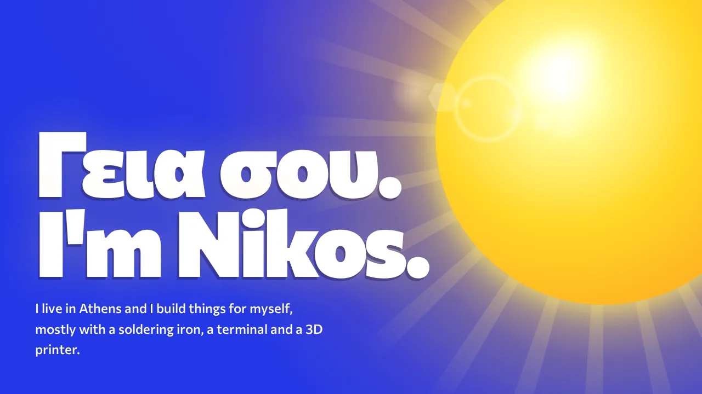
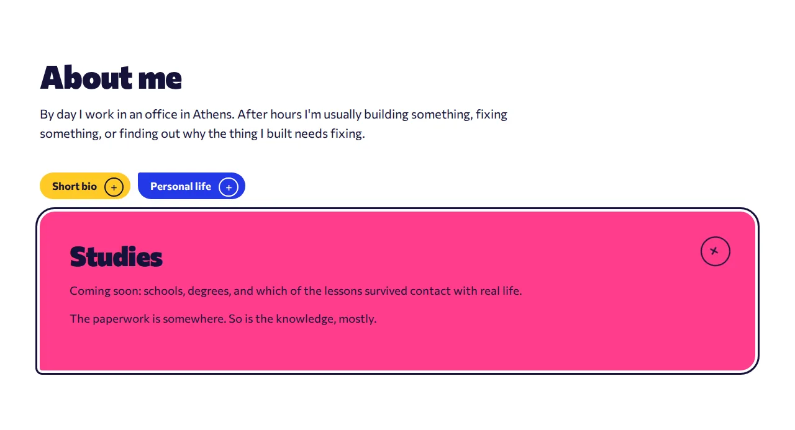

<div align="center">



# Nikos Kalogerinis · personal website

**A one-page “about me” site. Bold colors, a sun that follows your mouse, and exactly zero frameworks.**


</div>

---

## What's on the page

| Section | What happens there |
| --- | --- |
| ☀️ **Hero** | The sun rises, its rays turn slowly, and lens flares follow your pointer. Mostly because it could. |
| 🙋 **About me** | Three cards: Short bio, Studies, Personal life. Click one and it grows into a full panel. |
| 🛠️ **Hobbies & interests** | Homelab, ESP32 gadgets, 3D printing, productivity tools. Same trick, four cards. |
| 👋 **Say hello** | One very large email address and a few social links, with a warning about how often I check them. |

## Small things that took too long

- **Cards that morph.** Click a card and it expands into a full-width panel in its own color, while its siblings shrink into tabs. Built on the [View Transitions API](https://developer.mozilla.org/docs/Web/API/View_Transition_API). Browsers that don't support it just switch instantly and nobody gets hurt.
- **Links to a single card.** Every open card updates the URL, so `#about-studies` or `#hobbies-esp32` opens the page with that card already expanded. <kbd>Esc</kbd> and the Back button close it.
- **A spam-shy email address.** The address never appears in the HTML. It's put together in the browser at runtime, so the average harvesting bot leaves empty-handed. With JavaScript off, you get the classic `name [at] domain [dot] com`.
- **A tab that misses you.** Switch to another tab and the title quietly changes to *“☀ The sun's still up. Come back.”*
- **Motion manners.** If your system asks for reduced motion, the sun stays put and the cards swap without animating.

<div align="center">

</div>

## Run it locally

It's one file. Open `index.html` in a browser and you're done.

If you prefer it served properly:

```bash
cd PersonalWebsite && python3 -m http.server 8000
```

Then visit <http://localhost:8000>.

## What's in the repo

```text
.
├── index.html   # the whole site: markup, styles and scripts
├── cv/          # CV (EN + GR): content in cv_data.py, PDFs built by build_cv.py
├── docs/        # screenshots for this README
└── README.md    # you are here
```

## Hosting

Coming soon to **www.kalogerinis.net**, served from a small machine at home in Athens through a Cloudflare Tunnel. Uptime depends on the power grid, the UPS, and my patience, in roughly that order.

## Status

The design is done, more or less. The content is still compiling.

---

<div align="center">
<sub>Built in Athens by Nikos, one commit at a time.</sub>
</div>
